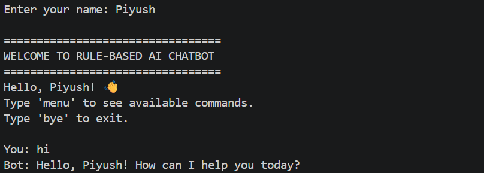
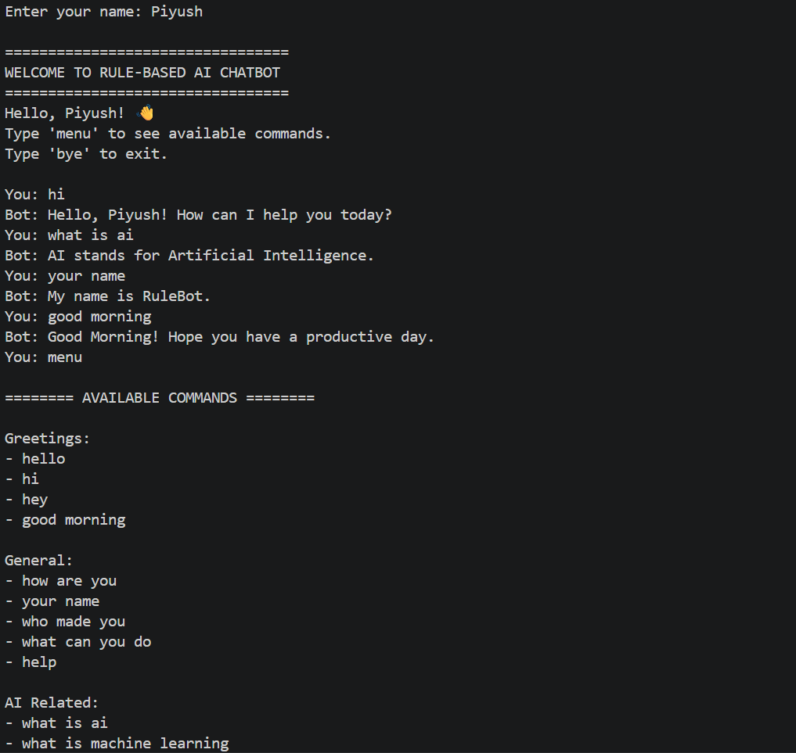
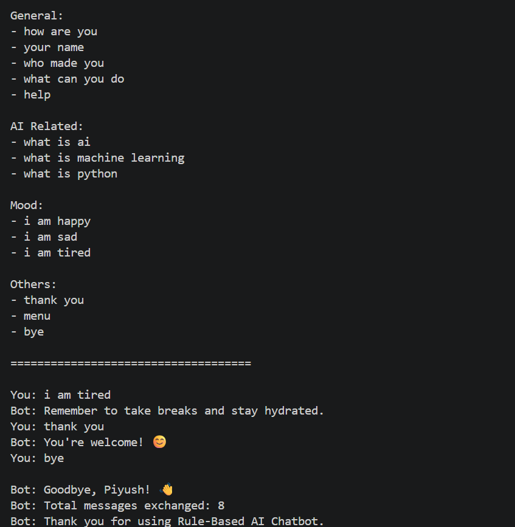
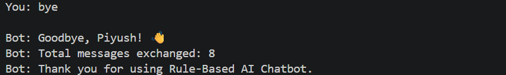

# 🤖 Rule-Based AI Chatbot

## 📌 Project Overview

This project is a Rule-Based AI Chatbot developed using Python as part of an AI Internship project.

The chatbot interacts with users by responding to predefined inputs using conditional statements (`if-elif-else`). It demonstrates the fundamental concepts of Artificial Intelligence through rule-based decision-making.

---

## 🎯 Objective

To create a chatbot that:

- Responds to user greetings
- Answers predefined questions
- Detects basic user moods
- Handles exit commands
- Runs continuously until the user chooses to quit

---

## ✨ Features

### Greetings
- hello
- hi
- hey
- good morning
- good afternoon
- good evening

### General Questions
- how are you
- your name
- who made you
- what can you do
- help

### AI Knowledge
- what is ai
- what is machine learning
- what is python

### Mood Detection
- i am happy
- i am sad
- i am tired

### Other Features
- Personalized welcome message
- Command menu
- Message counter
- Exit command
- User-friendly responses

---

## 🛠 Technologies Used

- Python 3
- If-Else Logic
- While Loop
- String Manipulation

---

## 📂 Project Structure

```text
Rule-Based-AI-Chatbot/
│
├── chatbot.py
├── README.md
├── requirements.txt
└── screenshots/
```

---

## ▶️ How to Run

### Step 1

Clone the repository:

```bash
git clone <repository-link>
```

### Step 2

Navigate to the project folder:

```bash
cd Rule-Based-AI-Chatbot
```

### Step 3

Run the chatbot:

```bash
python chatbot.py
```

---

## 💬 Sample Interaction

```text
=================================
WELCOME TO RULE-BASED AI CHATBOT
=================================

Hello, Rahul!

You: hello
Bot: Hello, Rahul! How can I help you today?

You: what is ai
Bot: AI stands for Artificial Intelligence.

You: i am happy
Bot: That's wonderful! Keep smiling.

You: bye

Bot: Goodbye, Rahul!
Bot: Total messages exchanged: 4
```

---

## 🧠 Concepts Demonstrated

- Rule-Based Artificial Intelligence
- Conditional Statements
- Loops
- User Input Handling
- String Processing
- Basic Human-Computer Interaction

---

## 🚀 Future Improvements

Possible enhancements:

- GUI using Tkinter
- Voice-based interaction
- Date and time responses
- More advanced conversation rules
- Database integration
- NLP-based chatbot using Machine Learning

---

## Author

Priya Das

B.Tech CSE Student

Developed as part of the DecodeLabs AI Internship.

## 📸 Screenshots

### Chatbot Startup



### Conversation Example





### Exit Message

